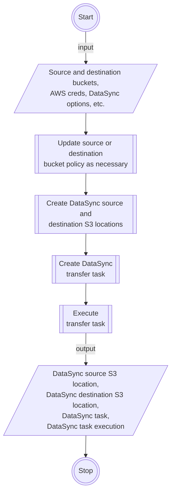

# DataSync S3 Transfer
Automate S3 object transfers between buckets via DataSync!

## Use Case

- Transfer S3 objects between AWS S3 buckets via DataSync, without having to click around the AWS Console.
- The necessary DataSync resources are generated for you, so you you don't have to.
- S3 transfer can be between buckets in the same AWS accounts, or across different accounts.
- for cross-account transfers, you can specify whether the source or destination AWS account does the transfer. (See issue [#1][3].)
- Create automation scripts using this tool, to initiate batch S3 object transfers between many buckets.

## Usage

1. Prepare inputs.

   ```js
   // source aws profile to the aws account where your source bucket is in
   const srcAwsProfile = {
     region: 'ap-northeast-1',
     credentials: {
       accessKeyId: 'ABCDEFGHIJKLMNOPQRST',
       secretAccessKey: 'WhHGQwvmvDaTne9LnMHV72A4cUkPkZWv2q6ieFtX'
     }
   };
   
   // if source and destination buckets belong to the same aws account, then...
   const destAwsProfile = srcAwsProfile;
   
   const dataSyncOptions = {
     /**
      * Whether it is the "source" or "destination" AWS account that does the
      * copying of S3 objects, i.e., the initiating account. For cross-account
      * transfers, this dictates which AWS account the necessary DataSync
      * resources will be created under. But for same-account transfers, then
      * setting we want is...
      */
     initiatingAccount: 'source',
    
     // source or destination aws account id, whichever is the initiating account
     dataSyncPrincipal: '123456789012',

     /**
      * Exisging IAM role from the initiating AWS account, with access to the
      * source and destination buckets. (See notes on permissions.)
      */
     dataSyncRole: 'arn:aws:iam::123456789012:role/MyExistingRole',
   
     // existing cloudwatch log group under the initiating account, where datasync will record logs into
     cloudWatchLogGroup: 'arn:aws:logs:ap-northeast-1:123456789012:log-group:/aws/datasync:*'
   };
   ```

   Notes:

   - If you want to do cross-account S3 object transfers, i.e., where the destination bucket is owned by a different AWS account than the source bucket, then set a different profile for `destAwsProfile` similar to `srcAwsProfile`.
   - the IAM user behind the AWS config provided in `srcAwsProfile` or `destAwsProfile`, depending if `initiatingAccount` equals `source` or `destination` respectively, must have DataSync-related permissoins set up first. See requirements on [IAM User Permissions](#iam-user-permissions).
   - The IAM role specified in `dataSyncoptions.dataSyncRole` must have the necessary permissions for DataSync to assume. See [IAM Role Permissions](#iam-role-permissions) on how the role must be setup.

1. Start the transfer. That's it!
   ```js
   import { initDataSyncS3Transfer } from "datasync-s3-transfer";

   // configure transfer settings
   const transfer = initDataSyncS3Transfer(srcAwsConfig, destAwsConfig, dataSyncOptions);
   
   // start the transfer
   await transfer(
     'source-bucket',              // existing source bucket name
     'destination-bucket',         // existing destination bucket name
     'Transfer to my other bucket' // the name of this transfer
   );
   ```

   After the `transfer()` call is made, source S3 objects will be copied to the destination bucket the after some time. See under the hood on [How A Transfer Is Made](#how-a-transfer-is-made).

1. Multiple transfers? Yes we can!

   ```js
   // initialize once
   const transfer = initDataSyncS3Transfer(srcAwsConfig, destAwsConfig, dataSyncOptions);
   
   const toTransfer = [
     { from: 'source-bucket-1', to: 'destination-bucket-1', name: 'Transfer task 1' },
     { from: 'source-bucket-2', to: 'destination-bucket-2', name: 'Transfer task 2' },
     // ...etc
   ];
   
   // transfer multiple times
   for (const item of toTransfer) {
     await transfer(item.from, item.to, item.name);
   }
   
   // or if you want to initiate the transfers concurrently...
   await Promise.all(
     toTransfer.map((item) => transfer(item.from, item.to, item.name))
   );
   ```

1. How to properly handle errors? See [Error Handling and Retries](#error-handling-and-retries) for details.

## How a Transfer is Made

Everytime a transfer call is made, the following happens under the hood within the initiating AWS account:

1. A DataSync source S3 location is created, poining to the source S3 bucket.

   If the initiating AWS account does not own the source bucket, then the source bucket policy is first updated in order to permit the initiating account to create the DataSync location.

1. A DataSync destination S3 location is created, pointing to the destination S3 bucket.

   If the initiating AWS account does not own the destination bucket, then the destination bucket policy is first updated in order to permit the initiating account to create the DataSync location. 

1. A DataSync transfer task is created.

1. The DataSync task is then executed, which creates a DataSync task execution resource and initiates the transfer of S3 objects between the source and destination DataSync locations.

Information on these created resources are then returned from the transfer call, into the `result` variable as seen below.

```js
// start the transfer
const { result, error } = await transfer('source-bucket', 'destination-bucket', 'Transfer to my other bucket');
```

## Error Handling and Retries

Errors can happen at any point during the transfer process, from network issues all the way up to misconfigurations on your part. In any case, you can check for errors via the `error` property returned by the transfer call.

```js
const { result, error } = await transfer('source-bucket', 'destination-bucket', 'Transfer to my other bucket');

if (error) {
  console.error(error);
}
else {
  console.info('Transfer successful!');
}
```

### Retrying a Failed Transfer

Understanding [How a Transfer is Made](#how-a-transfer-is-made), it is possible for an unexpected error (e.g., network or system error) to arise during any of the AWS resource-creation step. This can cause the transfer to become incomplete, where some of the necessary AWS resources have already been created, while the rest have not yet.

In this case, you can retry the transfer as follows:

```js
let transferState = await transfer('source-bucket', 'destination-bucket', 'Transfer to my other bucket');

// retry on error
while (transferState.error) {
  console.error(transferState.error);
  console.info('Retrying...');

  // you can also make retry optional by prompting retry confirmation first before executing this retry statement below
  transferState = await transfer('source-bucket', 'destination-bucket', 'Transfer to my other bucket', transferState.result);
}

// you can also retry despite script termination by exporting transferState.result, to a file for example
```

This way, successfully created AWS resources will be reused when retrying the transfer. Without supplying the `transferState.result` argument in the example above, calling `transfer()` mutiple times will create a new set of resources, which will likely cause AWS to complain about resource duplication.

## Permissions

### IAM User Permissions

In order to create the necessary DataSync resources on the initiating AWS account, this script assumes the IAM user behind the provided AWS config of the initiating account. In other words, using the code snippet from the [Usage](#usage) section as context, if `initiatingAccount` equals `source`, then the `srcAwsProfile` is used to create said resources. Else, if `initiatingAccount` equals `destination`, then the `destAwsProfile` is used instead.

This implies that the IAM user assumed by this script must be permitted certain actions in order to setup the DataSync-S3 transfer. These actions are:

- `datasync:CancelTaskExecution`
- `datasync:CreateLocationS3`
- `datasync:CreateTask`
- `datasync:DescribeLocation*`
- `datasync:DescribeTask`
- `datasync:DescribeTaskExecution`
- `datasync:ListLocations`
- `datasync:ListTasks`
- `datasync:ListTaskExecutions`
- `datasync:StartTaskExecution`
- `iam:AttachRolePolicy`
- `iam:CreateRole`
- `iam:CreatePolicy`
- `iam:ListRoles`
- `iam:PassRole`
- `s3:GetBucketLocation`
- `s3:ListAllMyBuckets`
- `s3:ListBucket`

### IAM Role Permissions

The IAM role, whose ARN is passed in the `srcDataSyncRole` DataSync initialization option, must have the necessaary permissions as shown in the following policy document:

```json
{
  "Version": "2012-10-17",
  "Statement": [
    {
      "Action": [
        "s3:GetBucketLocation",
        "s3:ListBucket",
        "s3:ListBucketMultipartUploads"
      ],
      "Effect": "Allow",
      "Resource": "arn:aws:s3:::*"
    },
    {
      "Action": [
        "s3:AbortMultipartUpload",
        "s3:DeleteObject",
        "s3:GetObject",
        "s3:ListMultipartUploadParts",
        "s3:GetObjectTagging",
        "s3:PutObjectTagging",
        "s3:PutObject"
      ],
      "Effect": "Allow",
      "Resource": "arn:aws:s3:::*/*"
    }
  ]
}
```

The idea is to allow certain actions on S3 objects that belong to the source and destination buckets. And by scoping the `Resource` properties as such, you can initiate S3 object transfers from _any_ buckets in the source AWS accuont, to _any_ buckets in the destination AWS account.

That being said, you can limit the scope of the `Resource` policy elements by explicitly listing the source and destination buckets only. Just keep in mind that S3 object transfers will not work if neither the source nor destination bucket is not included in this scope.

## High-Level System Design



[2]: https://repost.aws/knowledge-center/s3-large-transfer-between-buckets
[3]: https://github.com/C-Collamar/datasync-s3-transfer/issues/1