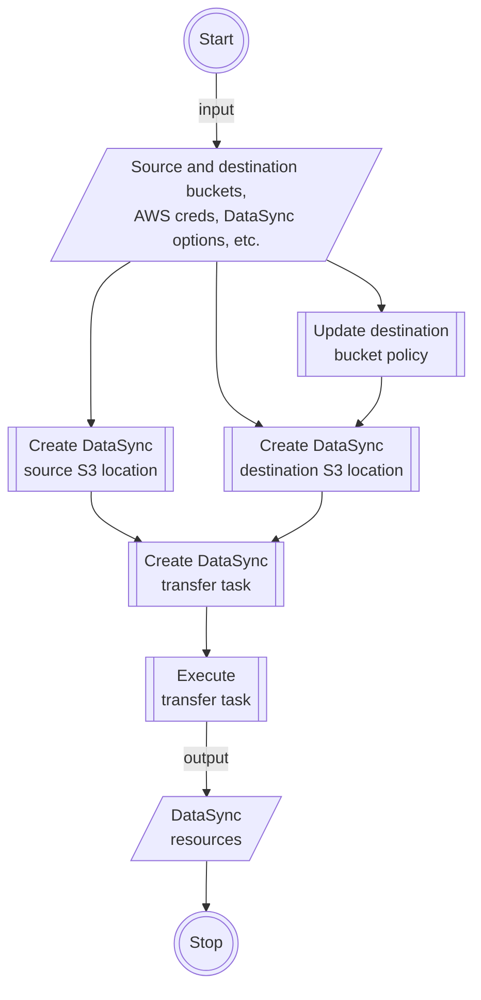

# DataSync S3 Transfer
Automate S3 object transfers between buckets via DataSync!

> 🚧 This guide is under construction. 🚧

## Use Case

- Transfer S3 objects between AWS S3 buckets via DataSync, without having to click around the AWS Console.
- S3 transfer can be between buckets in the same AWS accounts, or across different accounts.
- The necessary DataSync resources are generated for you, so you you don't have to.
- Create automation scripts using this tool, to initiate batch DataSync transfers between many buckets.

## Usage

1. Prepare inputs.

   ```js
   // source aws profile to the aws account where your source bucket is in
   const srcAwsProfile = {
     region: 'ap-northeast-1',
     credentials: {
       accessKeyId: 'ABCDEFGHIJKLMNOPQRST',
       secretAccessKey: 'WhHGQwvmvDaTne9LnMHV72A4cUkPkZWv2q6ieFtX'
     }
   };
   
   // if source and destination buckets belong to the same aws account, then...
   const destAwsProfile = srcAwsProfile;
   
   const dataSyncOptions = {
     // source aws account id, where your source bucket is in
     srcDataSyncPrincipal: '123456789012',
   
     // source iam role, with access to the source and destination buckets (see docs to set permissions)
     srcDataSyncRole: 'arn:aws:iam::123456789012:role/MyExistingRole',
   
     // source cloudwatch log group, where datasync will record logs into
     srcCloudWatchLogGroup: 'arn:aws:logs:ap-northeast-1:123456789012:log-group:/aws/datasync:*'
   };
   ```

   Notes:

   - If you want to do cross-account S3 object transfers, i.e., where the destination bucket is owned by a different AWS account than the source bucket, then set a different profile for `destAwsProfile` similar to `srcAwsProfile`.

   - The IAM role specified in `dataSyncoptions.srcDataSyncRole` must have the necessary permissions for DataSync to assume. See [IAM Role Permissions](#iam-role-permissions) on how the role must be setup.
   

1. Start the transfer. That's it!
   ```js
   import { initDataSyncS3Transfer } from "datasync-s3-transfer";

   // configure transfer settings
   const transfer = initDataSyncS3Transfer(srcAwsConfig, destAwsConfig, dataSyncOptions);
   
   // start the transfer
   await transfer(
     'source-bucket',              // existing source bucket name
     'destination-bucket',         // existing destination bucket name
     'Transfer to my other bucket' // the name of this transfer
   );
   ```

   After the call to `transfer()` has been made, source S3 objects will be copied to the destination bucket the after some time. See under the hood on [How A Transfer Is Made](#how-a-transfer-is-made).

1. Multiple transfers? Yes we can!

   ```js
   // initialize once
   const transfer = initDataSyncS3Transfer(srcAwsConfig, destAwsConfig, dataSyncOptions);
   
   const toTransfer = [
     { from: 'source-bucket-1', to: 'destination-bucket-1', name: 'Transfer task 1' },
     { from: 'source-bucket-2', to: 'destination-bucket-2', name: 'Transfer task 2' },
     // ...etc
   ];
   
   // transfer multiple times
   for (const item of toTransfer) {
     await transfer(item.from, item.to, item.name);
   }
   
   // or if you want to initiate the transfers concurrently...
   await Promise.all(
     toTransfer.map((item) => transfer(item.from, item.to, item.name))
   );
   ```

1. How to properly handle errors? See [Error Handling](#error-handling) for details.

## How A Transfer Is Made

Each time a transfer is made using this tool, the following AWS resources are created under the same AWS account that owns the source S3 bucket, in order:

1. DataSync source S3 location, pointing to the source S3 bucket.
1. DataSync destination S3 location, pointing to the destination S3 bucket.
1. DataSync task with a fixed configuration (e.g., basic logging enabled), used to initiate a transfer.
1. DataSync task execution, which is the byproduct of executing the created DataSync task.

Information on these created resources are then returned from the `transfer()` call, referenced under the [Usage](#usage) section.

## Error Handling

Errors can happen at any point during the transfer process, from network issues all the way up to misconfigurations on your part. In any case... work in progress.

## System Design



## Design Choices and Assumptions

Assumptions has to be made in making this project. If any assumptions
are not met, then this tool may not work prooperly.

- For cross-account bucket transfers, the transfer is initiated and managed from the source AWS account, rather than from the destination account.
- The source AWS config provided is assumed to be an IAM user who has the
  necessary permissions to perform DataSync-related actions. For more
  information on the required permissions, see [Tutorial: Transferring data from Amazon S3 to Amazon S3 across AWS accounts - AWS DataSync][1].

### IAM Role Permissions

Work in progress.

[1]: https://docs.aws.amazon.com/datasync/latest/userguide/tutorial_s3-s3-cross-account-transfer.html#awsui-tabs-1-9159-user-permissions-2
[2]: https://repost.aws/knowledge-center/s3-large-transfer-between-buckets