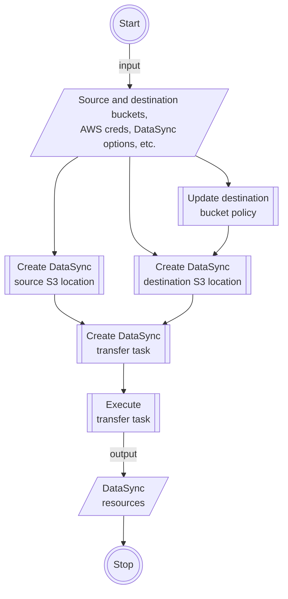

# DataSync S3 Transfer
Automate S3 object transfers between buckets via DataSync!

> 🚧 This guide is under construction. 🚧

## Use Case

- Transfer S3 objects between AWS S3 buckets via DataSync, without having to click around the AWS Console.
- S3 transfer can be between buckets in the same AWS accounts, or across different accounts.
- The necessary DataSync resources are generated for you, so you you don't have to.
- Create automation scripts using this package, to initiate batch DataSync transfers between many buckets.

## System Design

## Transfer Assumptions

There are assumptions made in the making of this project. If any assumptions
are not met, then this package may not work for you.

- For cross-account bucket transfers, where the source and destination buckets
  belong to different AWS accounts, it is the source AWS account that initiates
  the transfer to the destination account.
- The source AWS config provided, is assumed to be an IAM user who has the
  necessary permissions to perform DataSync-related actions. For more
  information on the required permissions, see [Tutorial: Transferring data from Amazon S3 to Amazon S3 across AWS accounts - AWS DataSync][1].

[1]: https://docs.aws.amazon.com/datasync/latest/userguide/tutorial_s3-s3-cross-account-transfer.html#awsui-tabs-1-9159-user-permissions-2